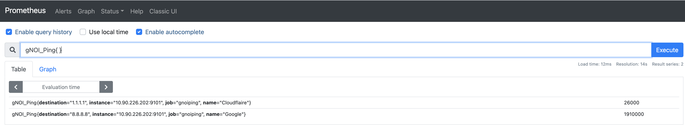

# Intro

### This is still considered beta at this point.  So use at your own risk in a non production environment.

This is a [prometheus exporter](https://prometheus.io/docs/instrumenting/exporters/) written in Golang that will connect to a device running the [gNOI](https://github.com/openconfig/gnoi) system service using the Ping method.  The program will then ping a given destination(s) that are witin the config.yaml and expose those as prometheus labels.  This can either run directly on a switch(eos) or on a server as a binary / microservice.

This is extremely similar to [ocprometheus](https://github.com/aristanetworks/goarista/tree/master/cmd/ocprometheus)

# Prerequisites
- Prometheus scraping server.
  Tested on v2.25.1

- Openconfig on the Switch.
  Needs to have the following configuration for Openconfig.
  ```
  management api gnmi
   transport grpc default
  ```

- Control-plane acl
  Since this will run on a port like 9101 which is not opened up.
  ```
  ip access-list def
   10 permit ip any any

  !
  system control-plane
   ip access-group def in
  ```
## Build
The binary for most systems is available within the /bin directory.

If you want to build from source the following works.
```
GOOS=linux GOARCH=386 go build
```

If running on a switch that is 32bit EOS

scp the gnoi-prometheus-exporter-386 binary to /mnt/flash of a EOS device.
```
scp gnoi-prometheus-exporter-386 admin@switchip://mnt/flash
```

# Usage

First edit the destination ip's within the config.yaml
### config.yaml
```
destinations:
 - name: Google
   destination: 8.8.8.8
 - name: Cloudflaire
   destination: 1.1.1.1
```

### Flags

```shell
  -config string
        Name of the config yaml file (default "config.yaml")
  -interval int
        Ping interval in time (default 1)
  -password string
        password for connection to gNOI (default "admin")
  -path string
        Path if different than original (default "/metrics")
  -port int
        Port to run prometheus on (default 9101)
  -target string
        Target ip or hostname of the device running gNOI
  -username string
        username for connection to gNOI (default "admin")
```

Example of running the binary on a system
```
cd bin
./gnoi-prometheus-exporter-linux -username admin -password admin -target x.x.x.x:6030 -config ../config.yaml -interval 10
```

The default openconfig port on a EOS switch is 6030.

There should be a bit of a logging output for verbosity.

```
Google   source:"8.8.8.8"  time:1960000  bytes:64  sequence:1  ttl:119
Cloudflaire      source:"1.1.1.1"  time:23000  bytes:64  sequence:1  ttl:64
Google   source:"8.8.8.8"  time:1890000  bytes:64  sequence:1  ttl:119
Cloudflaire      source:"1.1.1.1"  time:25000  bytes:64  sequence:1  ttl:64
```

Once this is finished should see a result within Prometheus similar to the following.




## Limitations

gNOI itself does not support vrfs.  So the pinging will have to occur within the global routing table itself.
